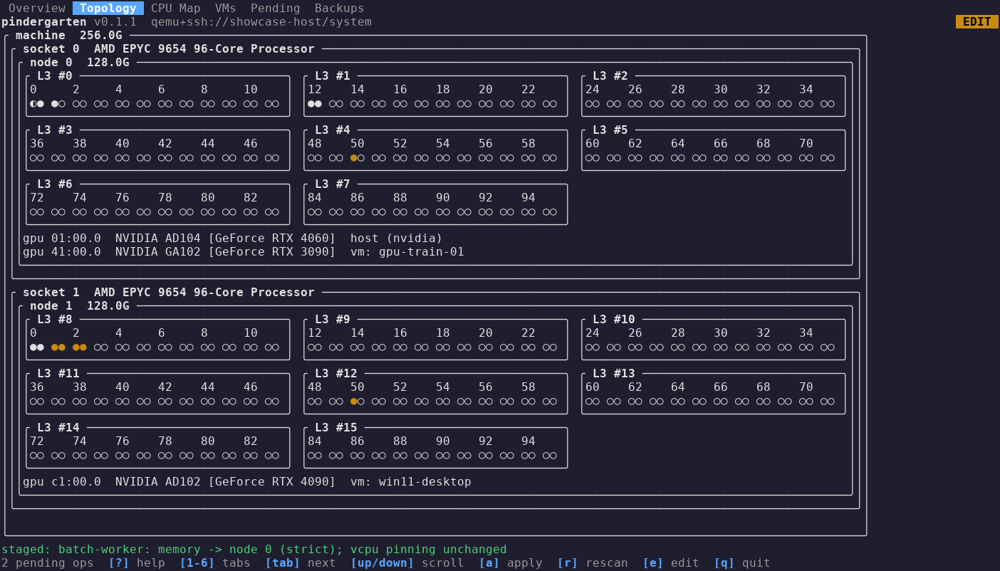
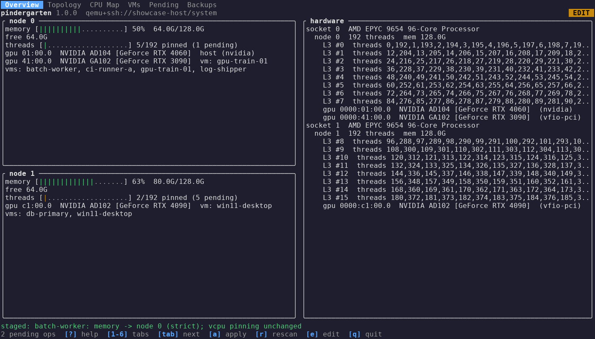
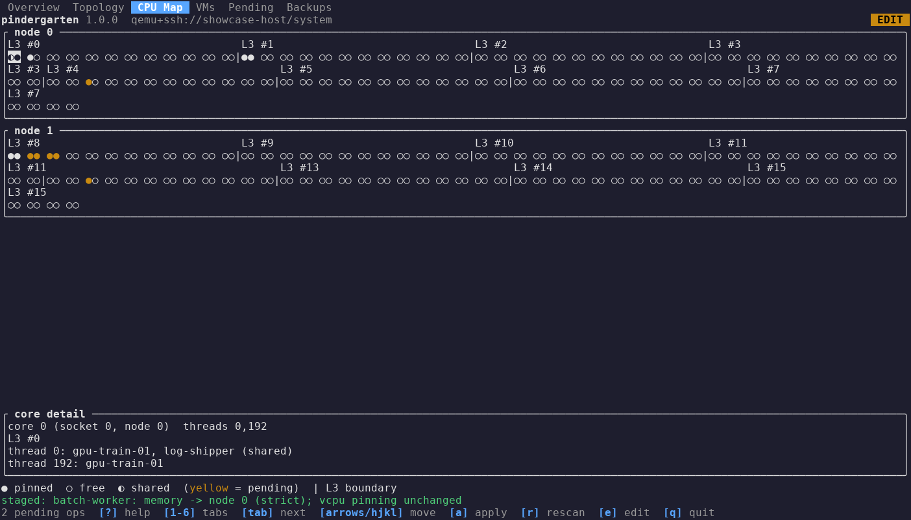
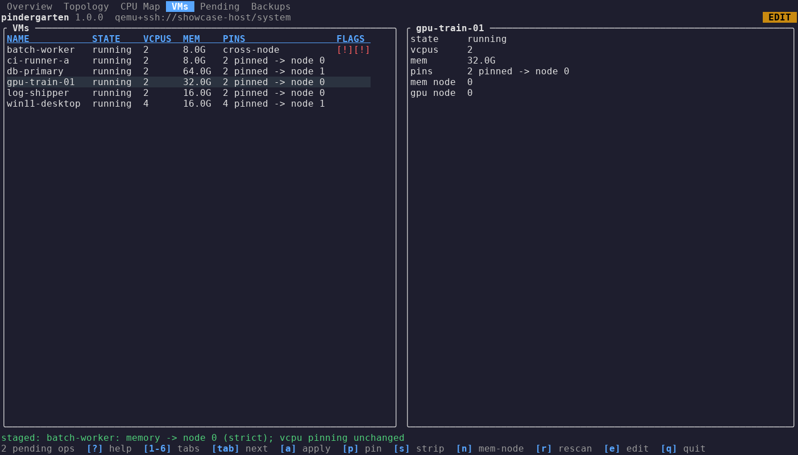
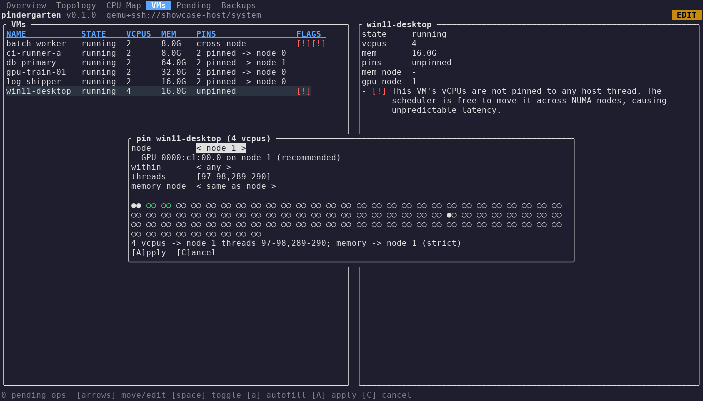
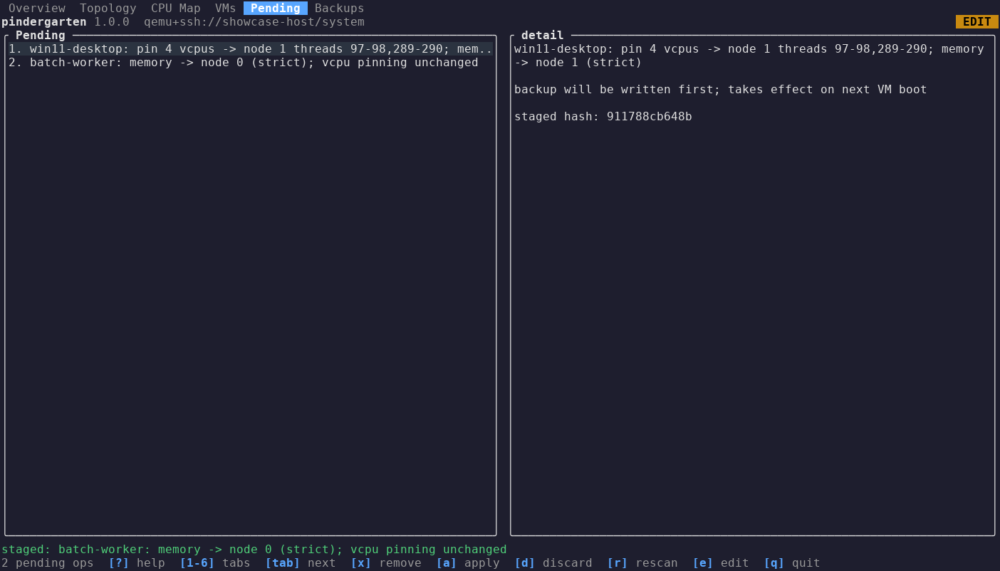

# pindergarten

pindergarten is a terminal UI for managing vCPU pinning and NUMA memory
binding on a two-socket KVM host. It scans the host's CPU/NUMA topology from
sysfs and every libvirt domain's configuration, shows which CPU threads and
memory nodes each VM is bound to, and lets you stage pin, unpin, and
numatune changes as a reviewable queue before applying them in one batch. It
runs as a single binary over SSH, works with mouse and keyboard, and never
trusts its own bookkeeping: every view is built from a fresh scan of
reality.

Built with help from Claude (Anthropic).

*The Topology tab: sockets, NUMA nodes and L3 domains as nested boxes, one
glyph per hardware thread, GPUs listed on the node they hang off.*

## Why NUMA pinning matters

A VM whose vCPUs run on one NUMA node while its guest memory lives on
another pays a cross-node memory latency penalty on every access, which
shows up as inconsistent, hard-to-diagnose performance, especially under
GPU passthrough workloads that are latency sensitive. Left unmanaged across
many VMs on a shared host, memory allocations also drift onto whichever
node has free pages at boot time, fragmenting host RAM until new VMs can no
longer find a contiguous NUMA-local allocation. Pinning vCPUs to threads on
the same socket as a VM's bound memory node keeps both the VM's performance
and the host's memory layout predictable.

## Install / build

Build dependencies (the libvirt cgo bindings need the development headers):

On Rocky Linux / RHEL-family systems:

    dnf install libvirt-devel golang

On Debian / Ubuntu:

    apt install libvirt-dev golang-go

Then, from the repository root:

    make init && make build

`make init` points git at the repo's hooks directory so the ASCII/format/vet
lint gate runs on commit. `make build` produces the `pindergarten` binary in
the repository root.

To build inside a clean Rocky-based container instead (useful for producing
a binary without installing build dependencies on your own machine):

    make release

This builds and runs `Containerfile.builder` with the repository mounted at
`/src`, so the resulting binary is dropped back into your working tree.

At runtime, only the libvirt client library is needed, not the -devel
headers: `libvirt-libs` on Rocky/RHEL, `libvirt0` on Debian/Ubuntu.

Prebuilt binaries: pushing a `v*` tag runs the release workflow, which
builds and tests inside Rocky Linux 9, Rocky Linux 10 and Ubuntu 26.04
containers and attaches `pindergarten-<tag>-rocky9-x86_64`,
`pindergarten-<tag>-rocky10-x86_64` and
`pindergarten-<tag>-ubuntu26.04-x86_64` (plus `.sha256` files) to the
GitHub release. Pick the one matching your host's distro so the glibc and
libvirt it links against match. Every push and pull request runs the same
test matrix plus the lint gate.

The screenshots in this README are rendered from a staged fixture by
`make screenshots` (writes into `docs/screenshots/`).

## Usage

    pindergarten [-c URI] [-backup-dir PATH]

- `-c URI`: libvirt connection URI. Defaults to `qemu:///system` (the local
  system libvirtd).
- `-backup-dir PATH`: where domain XML backups are written before each
  change. Defaults to a per-user location; see Backups below.

*Overview: per-node memory and thread usage, GPUs and the VMs living on
each node, plus a socket/NUMA/L3 hardware summary.*

pindergarten starts read-only: it can scan and display, but it will not
write anything to libvirt. On disk it only creates the backup directory at
startup and writes nothing else until you unlock edit mode. Press `e` in
the running app to
unlock edit mode, after a confirmation prompt. Before granting edit mode,
pindergarten writes and removes a small probe file in the backup directory
to confirm it is actually writable; if that fails, edit mode is refused
with the reason shown in the status bar. Edit mode also requires a
read-write libvirt connection, so you need to run as root or be a member of
the host's `libvirt` group (whichever your libvirtd's socket permissions
require). The top-right corner of the screen always shows a badge: red
`READ ONLY` or orange `EDIT`, so you always know which mode you're in.

The layout needs a terminal of at least 80x16 characters. Below that the
screen shows only a resize notice; enlarge the window or zoom out and the
interface returns.

*CPU Map: every thread's pin state, grouped by L3 domain, with a detail
panel for the selected core.*

## How changes apply

Every change you stage (pinning a vCPU to a thread, stripping a pin,
binding a VM's memory to a NUMA node, or restoring a domain from a backup)
is config-only: it edits the domain's `<cputune>` and/or `<numatune>` XML
via `virDomainDefineXML` and nothing else. It takes effect the next time the
VM boots; it never touches a running VM's live scheduling or memory
placement.

*VMs: each domain's state, pins, memory node, and flagged conflicts.*

*Pin wizard (`p` in edit mode): a proposed placement for the selected VM,
with node, L3 domain, thread list and memory node editable and previewed
live before staging.*

Staged changes sit in the Pending tab as a queue, not applied immediately.
This includes a restore: pressing `R` on a backup in the Backups tab stages
a restore operation rather than restoring on the spot, and it only takes
effect once you apply the queue like any other change. Before applying,
pindergarten re-checks each affected domain's current XML against what it
read when you staged the change (a drift check), so a change made outside
pindergarten in the meantime does not get silently clobbered. A backup of a
domain's XML is written before every write to that domain, with no
exceptions.

*Pending: staged operations queued for the next apply, each with the XML
hash it was staged against.*

## Backups

Backups are written to `-backup-dir`, which defaults to
`/var/lib/pindergarten/backups` when running as root, or
`$HOME/.local/share/pindergarten/backups` otherwise.

If you run under SELinux with root's default backup directory, leave it
under `/var/lib` rather than redirecting it elsewhere: `/var/lib` already
carries a context SELinux expects a system service's state to live in, and
relocating it can require a custom policy or `restorecon` work you don't
otherwise need.

## Keybindings

Keys marked "(edit mode)" are inert with a status-bar hint unless edit mode
is on; browsing and rescanning always work in read-only mode.

| Key | Where | Action |
|-----|-------|--------|
| `?` / `F1` | anywhere | show/hide the help overlay listing every key binding |
| `1`-`6` | anywhere | jump to tab: Overview, Topology, CPU Map, VMs, Pending, Backups |
| `Tab` / `Shift+Tab` | anywhere | next / previous tab |
| mouse click | tab bar | jump to that tab |
| arrows / `h j k l` | CPU Map | move the selected core |
| up/down / `j k` | VMs, Pending, Backups, Topology | move the selected row, or scroll the drawing (Topology) |
| mouse click | Topology, on a core box | jump to that core on the CPU Map tab |
| `e` | anywhere | toggle edit mode (confirmed) |
| `p` | VMs (edit mode) | open the pin wizard for the selected VM |
| `s` | VMs (edit mode) | stage stripping the selected VM's existing pin |
| `n` | VMs (edit mode) | open the set-memory-node picker for the selected VM |
| `x` | Pending (edit mode) | remove a staged operation from the queue |
| `a` | any tab (edit mode) | open the apply review for all staged operations |
| `d` | Pending (edit mode) | discard all staged operations |
| `R` | Backups (edit mode) | stage restoring the selected backup |
| `enter` | Backups | show a diff of the selected backup's XML against the domain's current XML |
| any key | Backups (diff shown) | close the diff and return to the list |
| `r` | anywhere | rescan host topology and libvirt domains |
| `q` | anywhere | quit (confirms first if operations are pending) |
| `ctrl+c` | anywhere | quit immediately, no confirmation (a backup is already on disk before any write, and every write is atomic) |

Set memory node (after `n`):

| Key | Action |
|-----|--------|
| digit `0`-`9` | stage a memory-node-only change to that node (vCPU pinning is left exactly as it was); warns, but never blocks, if it differs from the VM's GPU node or its current pin node -- a pick that crosses the GPU node opens a yes/no confirm ("Bind memory across the GPU's node anyway?") before staging |
| `esc` | cancel |

Pin wizard (after `p`): a form (node, within, threads, memory node) whose
live preview grid is editable in place -- toggle cores directly instead of
typing into the threads field -- staged with `[A]pply` or dropped with
`[C]ancel`.

| Key | Action |
|-----|--------|
| up/down / `j k` | move between the node/within/threads/memory node/core-grid fields; inside the grid, up/down / `j k` move the cursor by row; at the grid's top/bottom edge they leave to the previous/next field |
| left/right / `h l` | cycle the focused field's value, move the caret within the threads field, or move the core-grid cursor |
| backspace | (threads field) delete the character before the caret |
| `space` | (core grid) toggle the cursor's core into/out of the threads field |
| `a` | re-fill the threads field from the current proposal |
| `A` | stage the current form (or click `[A]pply`); a placement that crosses the VM's GPU node opens a yes/no confirm ("Pin across the GPU's node anyway?") before staging, never blocked outright |
| `C` / `esc` | cancel back out (or click `[C]ancel`) |

Apply review and drift (after `a`, while applying):

| Key | Screen | Action |
|-----|--------|--------|
| `y` | apply review | confirm and run the apply sequence |
| `n` / `esc` | apply review, or any `y`/`n` confirmation | cancel |
| up/down / `j k` | drift screen | select a drifted operation |
| `d` | drift screen | discard the drifted operation |
| `w` | drift screen | reopen the pin wizard for the drifted operation against fresh data (closes the drift screen even if other operations are still drifted) |
| `esc` | drift screen | close back to browsing; every operation, drifted or not, stays queued untouched |
| any key | results screen | dismiss the results screen and rescan |
